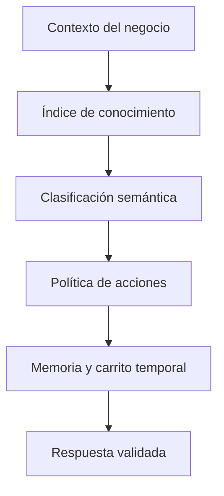

# Agente IA Universal v3

Estado: implementado en simulador, pendiente de fusión.

## Objetivo

Separar comprensión, conocimiento y efectos para que una frase nueva no requiera
añadir otra excepción al motor. El agente debe funcionar con cualquier negocio
que tenga contexto y conocimiento válidos, sin permitir que el modelo ejecute
acciones por sí mismo.

## Flujo final

1. **Contexto dinámico:** carga identidad, tipo, tono, catálogo, promociones,
   horarios, pagos informativos, políticas, reglas y datos de agenda por
   `clientId`.
2. **Centro de conocimiento:** incorpora productos, FAQs y documentos activos
   del negocio. No existe fallback demo entre negocios.
3. **Clasificación universal:** produce únicamente acto, tema, modo y un
   borrador semántico de artículos, cantidades y candidatos válidos. No puede
   producir acciones de carrito.
4. **Política determinista:** autoriza efectos solo cuando existe una compra
   explícita o una continuación inequívoca de memoria.
5. **Memoria conversacional:** conserva lista, propósito
   `information|purchase`, borradores de pedidos ambiguos, etapa de cierre,
   preferencia informativa de pago, turnos y carrito temporal.
6. **Respuesta comercial:** resume todos los artículos, calcula el total con
   precios validados, propone el siguiente paso y elimina datos internos.

## Autoridad de datos

| Dato | Fuente principal | Fuente complementaria |
|---|---|---|
| Producto, precio y disponibilidad | Catálogo real | Producto activo del Centro de Conocimiento |
| Promociones | Configuración vigente del negocio | Onboarding |
| FAQs y documentos | Centro de Conocimiento del negocio | Onboarding |
| Horarios, políticas y agenda | Configuración del negocio | Centro de Conocimiento |
| Acciones de carrito | Política local | Ninguna |
| Pagos reales | Fuera de alcance | Ninguna |

Un documento nunca reemplaza el precio o disponibilidad de un producto que ya
existe en el catálogo real.

## Contrato con Gemini

Gemini recibe solo el mensaje, memoria resumida y conocimiento recuperado para
ese negocio. Puede:

- resolver ambigüedad semántica;
- asociar el mensaje con claves ya autorizadas;
- proponer una redacción breve sobre hechos validados.

Gemini no puede:

- devolver `cartActions`;
- crear claves, productos, precios o promociones;
- convertir una consulta informativa en transacción;
- confirmar pagos, pedidos, reservas o envíos reales.

La política local ignora cualquier intento de elevar una intención informativa
a transaccional.

## Módulos

| Archivo | Responsabilidad |
|---|---|
| `universal-conversation-contract.ts` | Contratos entre las etapas |
| `universal-knowledge-engine.ts` | Índice y recuperación por negocio |
| `universal-order-parser.ts` | Artículos, cantidades, ambigüedad y medios configurados |
| `universal-intent-classifier.ts` | Señales locales y enriquecimiento semántico |
| `universal-decision-policy.ts` | Único punto que autoriza efectos |
| `universal-session-memory.ts` | Estado conversacional y continuidad |
| `universal-agent-contract.ts` | Validación del carrito y hechos |
| `universal-response-composer.ts` | Respuesta corta y comercial |
| `universal-agent-orchestrator.ts` | Orquestación completa y degradación segura |
| `universal-gemini-server.ts` | Adaptador controlado de Gemini |
| `universal-knowledge-center-server.ts` | Carga aislada del Centro de Conocimiento |
| `engine-universal-core-runtime.ts` | Integración con el simulador |

`engine-universal.ts` activa el nuevo runtime. WhatsApp y pagos conservan sus
rutas actuales y no forman parte de esta ejecución.

## Invariantes

- Información nunca crea carrito.
- Solo la política determinista crea acciones.
- Toda clave se revalida contra el negocio activo.
- Todo estado restaurado se revalida contra el catálogo actual.
- Una lista informativa mantiene su orden, pero no arma una compra.
- Una lista de compra puede continuar con selección y cantidad.
- Una negativa o “nada más” cierra la selección y nunca vuelve a mostrar el
  catálogo.
- Un pedido con varios artículos se aplica de forma atómica; si una variedad es
  ambigua, se conserva el borrador y no se elige al azar.
- Repetir o corregir una cantidad reemplaza esa línea en vez de duplicarla.
- Después de actualizar el pedido se muestra el resumen completo, el total y la
  pregunta de pago, pero solo se guarda una preferencia informativa.
- Una consulta de pagos usa exclusivamente la configuración de pagos; si no hay
  opciones habilitadas, se comunica sin lenguaje técnico.
- Una solicitud de total devuelve únicamente el resumen y la suma, sin ofertas
  ni preguntas adicionales.
- Si no hay promociones, solo se anuncia un plato destacado cuando está
  configurado; de lo contrario se recomienda un producto real sin llamarlo
  “plato del día”.
- El carrito es temporal y no crea pedidos reales.
- Sin conocimiento válido, se aclara; no se inventa.
- El resultado marca `whatsapp_sent=false` y `payments_executed=false`.

## Validación

La suite cubre restaurante, clínica y servicios; aislamiento entre negocios;
menú, precios, promociones, pagos, FAQs, agenda, selección numérica, pedidos
multilínea, correcciones sin duplicado, borradores ambiguos, sumatorias, cierre
informativo y un resultado malicioso de Gemini. La automatización de GitHub
ejecuta contratos, escenarios, memoria y núcleo completo en cada PR.
